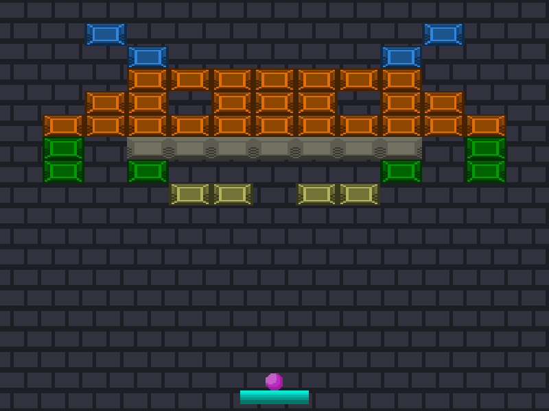

# LWJGL-Brakeout-Game

An in-progress arcade-style block breaking game. This was created in Java with OpenGL via LWJGL. The code was made following a C/C++ tutorial by [LearnOpenGL](https://learnopengl.com/In-Practice/2D-Game/Breakout). The graphics are my own.

Controls:
- A/LEFT ARROW - Move paddle left
- D/RIGHT ARROW - Move paddle right
- SPACE - Release ball

TO DO:
- Add menu and level select
- Implement scoring
- Implement concrete win/lose conditions
- Implement powerups
- And more
